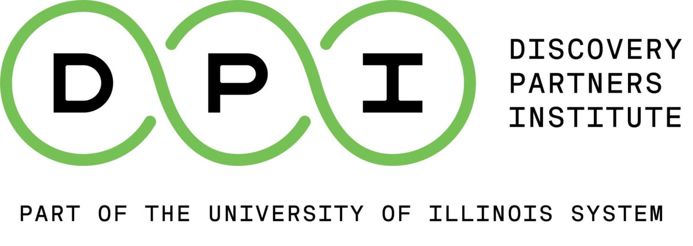

<h1 align="center" text="red">
    TA Manager Groups 💻
</h1>

  

<h2 align="center">
    This is a repository to see all of the trainees assigned to each TA Manager
</h2>

<h2 align="center">
    Feel free to add and delete trainees / TAs as they come and go. 
</h2> 

## 🤝 Current TAs:

### Jose Montes De Oca Morfin
<h3><a href="https://www.linkedin.com/in/josemontesdeocamorfin/"> LinkedIn</a></h3>
<h3><a href="https://github.com/JoseMDO/">GitHub</a></h3>

[🧑‍🧒‍🧒 TA Group](./jose/jose-ta-group.md)

### Annie Huynh 
<h3><a href="https://www.linkedin.com/in/annie-at-huynh/"> LinkedIn</a></h3>
<h3><a href="https://github.com/ahuynh3a">GitHub</a></h3>

[🧑‍🧒‍🧒 TA Group](./annie/annie-ta-group.md)

### Mary Webby 
<h3><a href="https://www.linkedin.com/in/marywebby/"> LinkedIn</a></h3>
<h3><a href="https://github.com/marywebby">GitHub</a></h3>

[🧑‍🧒‍🧒 TA Group](./mary/mary-ta-group.md)

### Aldo Portillo
<h3><a href="https://www.linkedin.com/in/aldoportillo/"> LinkedIn</a></h3>
<h3><a href="https://github.com/aldoportillo/">GitHub</a></h3>

[🧑‍🧒‍🧒 TA Group](./aldo/aldo-ta-group.md)

### Calvin Armstrong
<h3><a href="https://www.linkedin.com/in/calvin-armstrong-6745b096/"> LinkedIn</a></h3>
<h3><a href="https://github.com/armstrca">GitHub</a></h3>

[🧑‍🧒‍🧒 TA Group](./calvin/calvin-ta-group.md)

### Chandu Bhumireddy
<h3><a href="https://www.linkedin.com/in/chandhu-bhumireddy-022432190/"> LinkedIn</a></h3>
<h3><a href="https://github.com/bchandhu">GitHub</a></h3>

[🧑‍🧒‍🧒 TA Group](./chandu/chandu-ta-group.md)

## 🤝 Previous TAs: 
### (To Come)

## To contribute / Make Changes
* Clone this repo or create a codespace
* Create new issue
* Create a new branch with proper naming convention: (issue_number-initials-name_of_branch) "1-jm-add-initial-ta-groups"
* Create a PR and merge your branch into main 

